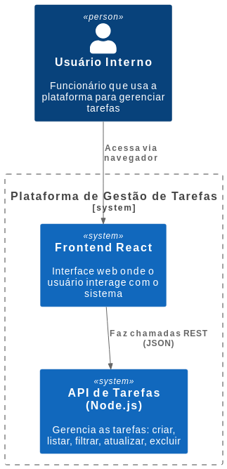
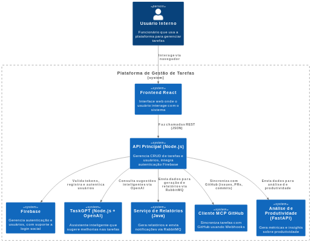
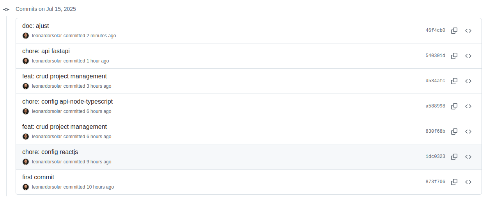
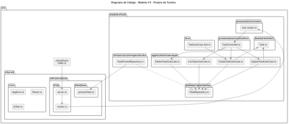
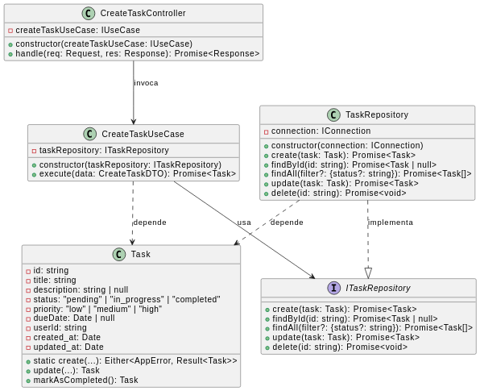
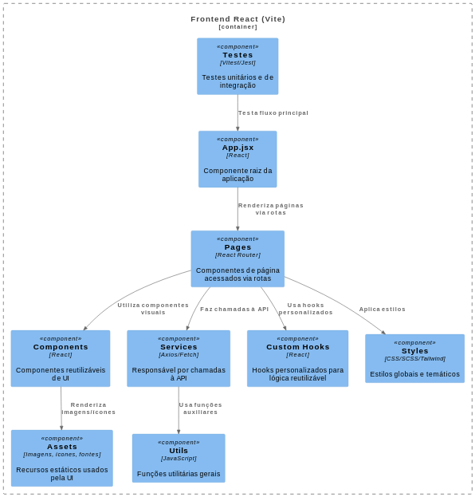
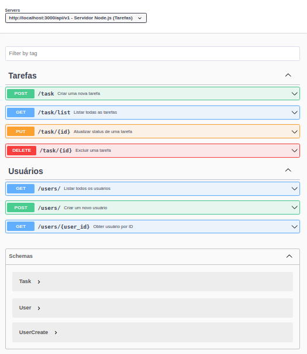
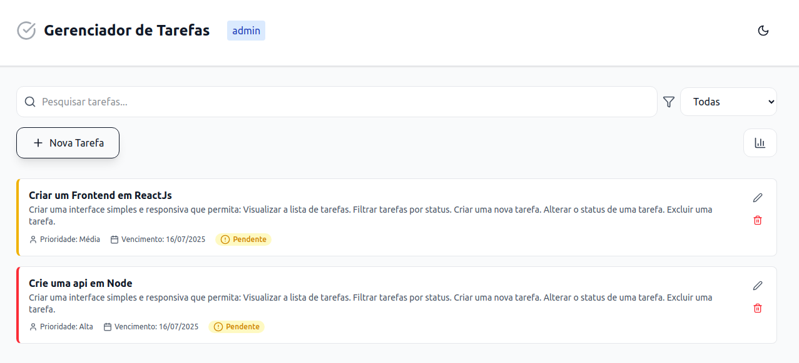
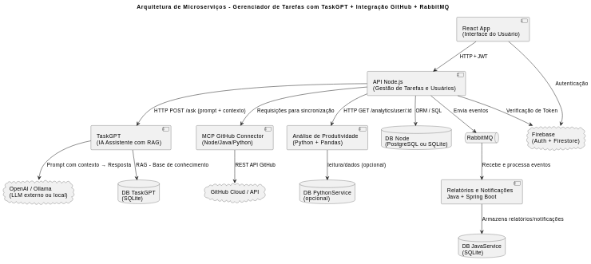
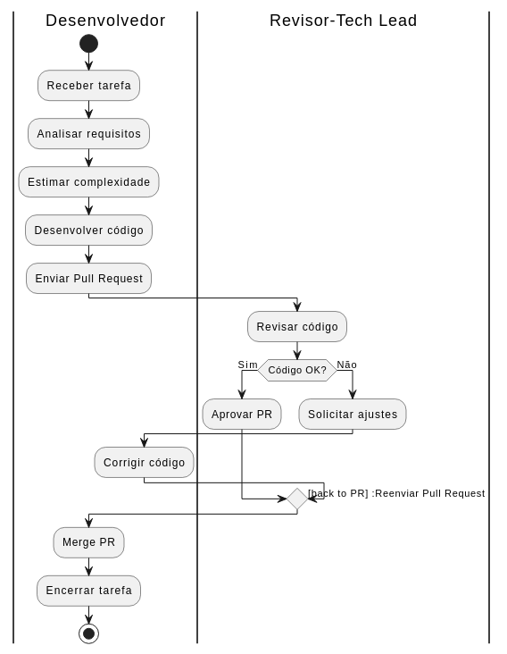

# Documentação do Projeto: Sistema de Gestão de Tarefas

- Plano de Projeto de Software (2025), baseado nas práticas tradicionais (IEEE 1058)

“Você precisa começar com a experiência do cliente e trabalhar de trás para frente, até chegar à tecnologia.” - Steve Jobs

### **1. Visão Geral do Projeto**

- **1.1 Nome do Projeto:** Plataforma de Gestão de Tarefas (challenge-task-management)
- **1.2 Objetivo:** Desenvolver uma aplicação interna de gestão de tarefas para auxiliar no acompanhamento de demandas. O sistema deve permitir o registro, edição, listagem e filtragem de tarefas, além de fornecer uma interface web para interação com os usuários

---

### **1.3 Componentes do Sistema Completo**

**Componentes do MVP**:

- **Frontend React (MVP):**
  Interface web responsiva desenvolvida em React, responsável pela interação com o usuário e consumo das APIs do sistema.

- **Backend Principal Node.js (MVP):**
  API RESTful que gerencia operações CRUD de tarefas e usuários, além de integrar autenticação via Firebase.

  

**Implementações futuras**:

- **Backend Cliente MCP GitHub:**
  Microserviço que sincroniza tarefas e eventos com a API do GitHub, gerenciando issues, pull requests e commits, utilizando autenticação e webhooks.
- **Firebase:**
  Serviço dedicado à gestão de usuários e autenticação, com suporte a email/senha e logins sociais, fornecendo endpoints RESTful para validação de tokens.
- **Backend TaskGPT:**
  Microserviço RESTful que integra com OpenAI para fornecer funcionalidades de assistente inteligente e enriquecimento das tarefas.
- **Backend Java Service:**
  Serviço responsável por geração de relatórios e notificações, comunicando-se com o backend principal via RabbitMQ.
- **Backend FastAPI (Análise e Produtividade):**
  API dedicada à análise de dados de produtividade, fornecendo métricas e insights a partir das tarefas.

  

---

- **1.4 Tempo Total de Desenvolvimento da MVP:** 10 horas

  Para mvp será desenvolvido o frontend e o backend com as principais funcionalidades.
  

  Após a mvp serão produzidos os demais requisitos.

- **1.5 Arquitetura de Alto Nível:**
  Diagrama de Contêiner – Backend Node (Model C4)
  

Dica:

- Instale a extensão PlantUML no Vscode.
- Acesse o arquivo doc/Diagram/DiagramadeConteineresC4.puml.
- Clique em “Preview” ou Alt + D para renderizar.

---

### **2. Engenharia de Requisitos (MVP)**

#### 2.1 Requisitos Funcionais (\*BP)

##### 2.1.1 Frontend

- **RF-FE01.** Exibir a lista de tarefas.
- **RF-FE02.** Filtrar tarefas por status.
- **RF-FE03.** Criar nova tarefa.
- **RF-FE04.** Alterar status da tarefa.
- **RF-FE05.** Excluir tarefa.
- **RF-FE06.** Consumir a API de backend.

##### 2.1.2 Backend (Node)

- **RF-BE01.** Criar tarefa via `POST /tasks`.
- **RF-BE02.** Listar tarefas via `GET /tasks`.
- **RF-BE03.** Filtrar por status com parâmetro `GET /tasks?status=...`.
- **RF-BE04.** Atualizar status com `PATCH /tasks/:id/status`.
- **RF-BE05.** Remover tarefa com `DELETE /tasks/:id`.

#### 2.2 Requisitos Não Funcionais

##### 2.2.1 Frontend

- **RNF-FE01.** Interface responsiva.
- **RNF-FE02.** Design com foco em usabilidade.
- **RNF-FE03.** Comunicação com backend via JSON.

##### 2.2.2 Backend (Node)

- **RNF-BE01.** APIs RESTful com uso de JSON.
- **RNF-BE02.** Separação de responsabilidades: controllers, services, models.
- **RNF-BE03.** Documentação da API com OpenAPI (Swagger).

### 2.3 Roadmap MVP (Simplificado) (\*BP)

| Fase | Entrega                                     | Prazo Estimado |
| ---- | ------------------------------------------- | -------------- |
| 1    | Backend Node.js com CRUD de tarefas         | 4H             |
| 2    | Frontend com exibição e controle de tarefas | 4H             |
| 3    | Integração total + testes automáticos       | 2H             |

---

### 2.4 Product Backlog MVP (Prioridade Alta → Baixa) (\*BP)

| ID   | História de Usuário                                           | Prioridade |
| ---- | ------------------------------------------------------------- | ---------- |
| US01 | Como usuário, quero criar tarefas para organizar meu dia      | Alta       |
| US02 | Como usuário, quero visualizar a lista de tarefas             | Alta       |
| US03 | Como usuário, quero filtrar tarefas por status                | Alta       |
| US04 | Como usuário, quero alterar o status das tarefas              | Média      |
| US05 | Como usuário, quero excluir tarefas que não preciso mais      | Média      |
| US06 | Como admin, quero listar usuários para controle de acesso     | Baixa      |
| US07 | Como usuário, quero me autenticar para acessar minhas tarefas | Baixa      |

**Priorizar requisitos usando técnicas como MoSCoW**

#### Critérios de Aceitação por Funcionalidade: (\*BP)

| ID   | História de Usuário                  | Critérios de Aceitação                                                                                                 |
| ---- | ------------------------------------ | ---------------------------------------------------------------------------------------------------------------------- |
| US01 | Criar tarefas para organizar meu dia | - O usuário deve preencher título e status<br>- A tarefa deve ser salva com sucesso<br>- Exibir confirmação de criação |
| US02 | Visualizar a lista de tarefas        | - Ao acessar o sistema, as tarefas do usuário logado devem ser listadas<br>- Exibir título, status e data de criação   |
| US03 | Filtrar tarefas por status           | - O usuário pode selecionar um status (pending, in_progress, completed)<br>- A lista deve ser atualizada dinamicamente |
| US04 | Alterar o status das tarefas         | - O usuário pode escolher outro status para a tarefa<br>- O novo status deve ser salvo e refletido na UI               |
| US05 | Excluir tarefas que não precisa mais | - O usuário pode clicar em "Excluir"<br>- Um alerta de confirmação é exibido<br>- A tarefa é removida da lista         |
| US06 | Listar usuários (admin)              | - A API `/users` deve retornar todos os usuários cadastrados<br>- A resposta deve conter ID, nome e e-mail             |
| US07 | Autenticar para acessar tarefas      | - O usuário insere e-mail e senha<br>- Se corretos, recebe um token de acesso<br>- Redireciona para a tela de tarefas  |

### 2.5 Identificar stakeholders (\*BP)

CEO, Tech Lead, Desenvolvedores

### 2.6 Plano de Testes

- Escreva testes unitários e de integração.
- Use ferramentas como Jest, Pytest ou Vitest.
- Execute testes com Husky antes do push.
- Automatize com CI (GitHub Actions).
- Documente os cenários e resultados esperados.
- Criar testes de carga e performance.

## 

### **2.7 Segurança**

Para garantir segurança desde a fase de requisitos até a entrega, adotar as seguintes práticas:

#### 🔒 Backend

- Validação e sanitização de entradas.
- Proteção contra ataques com rate limiting e `helmet`.
- Logs sem dados sensíveis.
- Autenticação com JWT e senhas com bcrypt.
- Controle de acesso por perfil (usuário/admin).

#### 🛡️ Frontend

- Escapar dados exibidos (evitar XSS).
- Validar dados no cliente e no servidor.
- Usar HTTPS e tokens com cuidado.

#### ⚙️ DevOps / CI/CD

- Análise de vulnerabilidades com `npm audit`, `bandit` ou `snyk`.
- Husky + lint + testes antes de `push`.
- CI com testes automatizados e varredura de segurança.
- Branches protegidos e revisão obrigatória.
- Evitar versionar segredos (usar `.env` e secret scanning).

#### 2.7 Metodologia de desenvolvimento (\*BP)

Utilizaremos uma abordagem híbrida baseada em Scrum e Extreme Programming (XP):

Scrum para organização do projeto em sprints semanais, com reuniões diárias (daily) e review ao final de cada sprint.

XP para práticas de desenvolvimento como programação em pares, refatoração contínua, testes automatizados e integração contínua (CI).

Essa combinação garante entregas rápidas, feedback constante e alta qualidade do código.

---

### **3. Execução e Instalação**

- **3.1 Clonar o Repositório**

```bash
git clone https://github.com/leonardorsolar/challenge-task-management.git
cd challenge-task-management
```

- **3.2 Instalar e Rodar Backend Node.js**

```bash
cd backend/api-node-typescript
npm install
npm run dev
```

- **3.3 Instalar e Rodar Frontend React**

```bash
cd frontend/project-management
npm install
npm run dev
```

- **3.4 Acesso:** [http://localhost:5173](http://localhost:5173)

---

### **4. Estrutura Completa do Projeto**

- **4.1 Estrutura Geral de Pastas**

```
project-management/
├── backend/
│   ├── api-fastapi/
│   ├── api-node-typescript-ia/
│   ├── mcp-agent/
│   └── api-node-typescript/
├── docs/
│   ├── image
│   ├── openapi.json
│   ├── Diagram
│   └── swagger.yaml
├── frontend/
├── scripts/
├── package.json
└── README.md
```

- **4.2 Estrutura Backend Principal Node**

Estrutura do Projeto Backend (Node) e Responsabilidades

```
index.ts                          # Entrada principal da aplicação

modules/
└── task/                        # Módulo de gerenciamento de tarefas
    ├── application/
    │   └── usecases/            # Casos de uso (regras de negócio)
    │       ├── CreateTaskUseCase.ts
    │       ├── DeleteTaskUseCase.ts
    │       ├── ListTasksUseCase.ts
    │       └── UpdateTaskStatusUseCase.ts
    ├── domain/                  # Entidades e interfaces de repositório
    │   ├── entities/            # Modelo de domínio (Task)
    │   └── repositories/       # Interfaces para persistência (ITaskRepository)
    ├── infrastructure/         # Implementações concretas (ex: acesso a dados)
    │   └── repositories/
    │       └── TaskRepository.ts
    ├── presentation/            # Controllers e rotas da API
    │   ├── controllers/
    │   └── routes/
    └── test/                   # Testes unitários e de integração

shared/                         # Código e recursos compartilhados
├── core/                       # Utilitários e tipos base (ex: AppError, Result, Either)
└── infrastructure/             # Configurações, conexões e APIs externas
    ├── database/               # Adapters e scripts para diferentes bancos de dados
    └── http/                   # Configuração do servidor HTTP e rotas globais
                # Ambiente virtual Python
```

Diagrama de Componentes – Backend Node (Model C4)


Diagrama de Código – Modelo C4



Diagrama de Classe - UML



- **4.4 Estrutura Frontend React**
  Estrutura do Projeto Frontend

```
frontend/
├── src/
│   ├── assets/
│   ├── components/
│   ├── pages/
│   ├── services/
│   ├── hooks/
│   ├── styles/
│   ├── util/
│   ├── test/
│   └── App.jsx
├── public/
├── package.json
└── README.md
```

Diagrama de Componentes – Frontend React (Model C4)


---

### **5. Diagramas do Sistema** (\*BP)

- Diagrama de Contêiner (C4 - Node)
- Diagrama de Componentes (Node, FastAPI, React)
- Diagrama de Código
- Diagrama de Classes (UML)
- Diagrama Entidade-Relacionamento (DER)
- Diagrama de implantação

Acessos aos arquivos:

- Acesse o arquivo doc/Diagram/...
- clique no arquivo desejado
- Clique em “Preview” ou Alt + D para renderizar.

---

### **6. Documentação da API**

- Listagem dos endpoints:

  - `POST /tasks`
  - `GET /tasks`
  - `PATCH /tasks/:id/status`
  - `DELETE /tasks/:id`

- Local: `/doc/swagger.yaml`
- Imagem: (API Swagger UI)



Acessos ao arquivo:

- Acesse o arquivo doc/swagger.yaml
- clique no arquivo
- Clique com o botão direito do mouse e selecione “Preview Swagger” ou Shift + Alt + P para renderizar.

---

### **7. Tecnologias Utilizadas**

- **Backend Node:** Node.js, Express, TypeScript
- **Frontend:** React.js, Vite, Axios, Lucide-react
- **Testes:** Jest, Testing Library
- **Documentação:** Swagger (OpenAPI)

---

### **8. Funcionalidades Implementadas**

#### Backend

- CRUD de tarefas
- Filtro por status
- Documentação via Swagger

#### Frontend

- Visualização e gerenciamento de tarefas
- Filtro por status
- Comunicação com APIs



---

### Solicitações de informações extras

## 9. Arquitetura e Decisões Técnicas

Perfeito! Aqui está o texto reestruturado com a separação entre **MVP** e **Projeto Completo**, mantendo alinhamento com os componentes do sistema:

---

### **9.1 Tecnologias e Justificativas**

#### **Tecnologias do MVP**

- **Backend (API Principal):**
  Utilizei **Node.js com Express** por sua eficiência na construção de APIs RESTful, facilidade de manutenção e integração com outras tecnologias. A escolha também se baseou no suporte da comunidade e rápida prototipação.

- **Banco de Dados:**
  Adotado o **SQLite** para acelerar o desenvolvimento inicial e testes locais. A arquitetura está preparada para uso futuro de bancos relacionais robustos como **PostgreSQL** ou **MySQL**, ideais para produção.

- **Frontend:**
  Desenvolvido em **React.js** com **Vite**, proporcionando carregamento rápido, hot reload e uma experiência de desenvolvimento moderna. O frontend foi mantido livre de bibliotecas visuais pesadas, garantindo maior controle e personalização da interface.

- **Documentação da API:**
  A documentação foi feita com **Swagger (OpenAPI)**, permitindo visualização e testes diretos das rotas. Para clareza e padronização, foram utilizadas ferramentas de IA (OpenAI) no auxílio da geração dos exemplos e descrições.

---

#### **Tecnologias do Projeto Completo (Próximas Fases)**

- **Autenticação:**
  A autenticação e o gerenciamento de usuários foram implementados com o **Firebase Authentication**, que oferece suporte a login por e-mail/senha e provedores sociais.

- **Microserviço TaskGPT (Node.js + OpenAI):**
  Microserviço responsável por enriquecer tarefas com sugestões inteligentes, resumos e subtarefas usando **modelos de linguagem da OpenAI**.

- **Microserviço MCP GitHub:**
  Serviço que realiza a **integração contínua com GitHub**, sincronizando issues, pull requests e commits via **webhooks e autenticação com token**.

- **Serviço de Relatórios (Java):**
  Serviço assíncrono desenvolvido em **Java**, responsável pela **geração de relatórios e envio de notificações**. Comunica-se com o backend principal usando **RabbitMQ**.

- **API de Análise de Produtividade (FastAPI):**
  Serviço dedicado à análise de produtividade dos usuários, que fornece **métricas e insights** com base nas tarefas e interações.

- **Fila de Mensagens:**
  Utilização de **RabbitMQ** para troca assíncrona de mensagens entre serviços, garantindo escalabilidade e desacoplamento entre os módulos.

---

### 9.2 Organização do Código e Separação de Responsabilidades

- Backend Node separado em camadas (Arquitetura Clean Architecture):

  - **index.ts:** Ponto de entrada principal da aplicação, responsável por iniciar o servidor e injetar as dependências.
  - **modules/task/application:** Camada de aplicação que orquestra os casos de uso.
  - **modules/task/application/usecases:** Contém os casos de uso, que representam as regras específicas de negócio.
  - **modules/task/domain:** Camada de domínio que representa a lógica central da aplicação.
  - **modules/task/domain/entities:** Entidades do negócio, incluindo modelo e comportamento.
  - **modules/task/domain/repositories:** Interfaces que definem os contratos para persistência de dados.
  - **modules/task/infrastructure:** Camada de infraestrutura com implementações concretas das interfaces do domínio.
  - **modules/task/infrastructure/repositories:** Implementações dos repositórios definidos no domínio.
  - **modules/task/presentation:** Camada de apresentação, interface entre a aplicação e o mundo externo.
  - **modules/task/presentation/controllers:** Controladores que recebem requisições e invocam os casos de uso.
  - **modules/task/presentation/routes:** Arquivos que definem as rotas da API.
  - **modules/task/test:** Testes unitários e de integração para o módulo de tarefas.
  - **shared/core:** Código compartilhado que contém tipos base, utilitários e objetos para tratamento de erros e resultados (como AppError, Either, Result).
  - **shared/infrastructure:** Infraestrutura compartilhada, incluindo conexão com banco de dados e configurações.
  - **shared/infrastructure/database:** Configuração e gerenciamento da conexão com o banco de dados.
  - **shared/infrastructure/http:** Configuração do servidor HTTP, middleware e rotas globais.

- Frontend modularizado em componentes reutilizáveis, páginas e serviços para chamadas API.
- Testes organizados em pastas dedicadas, separados por tipo (unitários, integração).

### 9.3 Escolher padrões de design apropriados (MVC, Repository, Factory, etc.).(\*BP)

### 9.4 Definir APIs e contratos de integração..(\*BP)

---

### 9.5 Evolução e Escalabilidade

### **Evolução Arquitetural**

1. **Integração com Firebase**

   - Autenticação centralizada (email/senha, Google, etc.).
   - Gerenciamento de perfis no Firestore.
   - Validação de tokens JWT no backend Node.js.

2. **Adição do Microserviço TaskGPT (IA Assistente de Tarefas)**

   - Novo serviço baseado em **LLM** para auxiliar desenvolvedores, tech leads e gestores com sugestões automáticas, geração de código e melhoria de produtividade.
   - A comunicação é feita via API HTTP, com prompts estruturados enviados a um modelo de linguagem (via OpenAI e Anthropic).
   - Realiza consultas à base de dados de tarefas para fornecer respostas com contexto atualizado.
   - Exemplo de uso:

     - **Dev (nível operacional - ajuda técnica)**: Solicita ajuda para gerar um endpoint REST de tarefas com base em um schema.
     - **Tech Lead (nível gerencial - visão de complexidade, dependências, riscos)**: Recebe sugestões de refatorações técnicas e melhorias baseadas nas tarefas atuais.
     - **CEO/PM (nível estratégico - visão de valor, prazo e produtividade)**: Pergunta "quais tarefas estão em atraso?" e recebe insights consolidados em linguagem natural.

   - Depois poderá ser implemento: RAG (Retrieval-Augmented Generation)

3. **Integração com Sistemas Externos via Cliente MCP (Github)**

   - Inclusão de um **cliente ou servidor MCP (Microservice Communication Protocol)** que realiza integração com o **github**, permitindo:

     - Envio das infromações das tarefas via issues para o github

4. **Incorporação de Mensageria (RabbitMQ)**

   - Envio assíncrono de eventos e comandos (ex: gerar relatório, análise de tarefas).
   - Aumento da resiliência e desacoplamento entre os serviços.

5. **Expansão do Ecossistema de Microserviços**

   - A arquitetura segue evoluindo para um modelo mais inteligente e automatizado, promovendo:

     - **Colaboração assistida por IA**.
     - **Interoperabilidade com plataformas externas**.
     - **Maior autonomia para os usuários através de interações em linguagem natural**.

     

---

#### **Performance e Escalabilidade**

- A arquitetura modular permite escalar partes do sistema separadamente.
- Os microserviços podem ser replicados e balanceados independentemente.
- Uso de mensageria para evitar bloqueios e melhorar o tempo de resposta.

---

#### **Manutenção e Entregas Contínuas**

- Ampliação de cobertura de testes (unitários, integração e e2e).
- Pipeline de **CI/CD** para automatizar testes, builds e deploys.
- Documentação técnica sempre atualizada junto ao código.
- Monitoramento e métricas para tomada de decisões (ex: tempo de resposta, taxa de erro).

## 10. Simulação de Distribuição de Tarefas na Equipe

| Desenvolvedor                   | Responsabilidades Técnicas                                                                                                                                                                                                                                                                                                                                         | Entregas Principais                                                                                                                             |
| ------------------------------- | ------------------------------------------------------------------------------------------------------------------------------------------------------------------------------------------------------------------------------------------------------------------------------------------------------------------------------------------------------------------ | ----------------------------------------------------------------------------------------------------------------------------------------------- |
| **Dev A (Backend + Tech Lead)** | - API RESTful em **Node.js + Express**<br>- Modelagem e lógica de negócio<br>- Testes unitários com **Jest**<br>- Configuração de **CI/CD**<br>- **Documentação com Swagger**<br>- **Responsável por revisão de Pull Requests**<br>- **Garantia de qualidade (QA)**<br>- Suporte à integração entre frontend e backend<br>- Controle de versionamento e convenções | Endpoints documentados e testados, banco de dados configurado, CI/CD funcionando, revisões de código realizadas, qualidade de projeto garantida |
| **Dev B (Backend)**             | - API RESTful em **Node - Firebase**<br>- Autenticação e gerenciamento de usuários<br>- Testes com **jest/libray**<br>- Documentação OpenAPI<br>- Integração com frontend                                                                                                                                                                                          | Endpoints de usuários, autenticação funcional, documentação gerada, cobertura de testes garantida                                               |
| **Dev C (Frontend)**            | - Interface em **React**<br>- Consumo de APIs<br>- Interface responsiva com foco em usabilidade<br>- Validações no frontend<br>- Testes e2e com Playwright (com apoio do Dev A)                                                                                                                                                                                    | Funcionalidades completas de CRUD de tarefas com filtros, layout responsivo, testes básicos automatizados                                       |

---

**Obs.:** A adoção de uma arquitetura modular e desacoplada, baseada em princípios do Domain-Driven Design (DDD), facilita a escalabilidade da equipe, permitindo a inclusão de novos desenvolvedores de forma segura e com uma divisão de tarefas mais eficiente.

## Tech Lead – Dev A

**Atribuições específicas como líder técnico:**

- Aprovação obrigatória de todos os _Pull Requests_
- Garantia de padrões de código (lint, arquitetura em camadas, nomenclatura)
- Organização dos branches (main, dev, feature/_, fix/_)
- Avaliação de qualidade dos testes (unitários, integração e e2e)
- Garantia de cobertura mínima de testes (ex: 80%)
- Suporte aos devs em dúvidas técnicas ou conflitos de merge
- Garantia de que a documentação está atualizada
- Treinamentos (delegar + criação de um sucessor)
- Feedback para o CEO

---

## Qualidade de Software

- **QA (Quality Assurance)**: Revisões de código, Auditorias de processo, revisões técnicas.
- **QC (Quality Control)**: Testes funcionais, de usabilidade e de desempenho.

### Garantia de Qualidade (QA)

- **Testes Unitários**: Jest (Node.js) e Pytest (Python).
- **Testes de Integração**: Entre controllers, services e repositórios.
- **Testes End-to-End (E2E)**: Playwright no frontend simulando uso real.
- **CI/CD**: Execução automática de testes e builds via GitHub Actions.
- **Sonar Cloud**: Análise de código (bugs, vulnerabilidades de segurança, "code smells")

#### Checklist de Pull Requests (PRs)

- Testes automatizados incluídos e aprovados.
- Documentação (Swagger) atualizada.
- Padrões de código aplicados (lint, formatação).
- Revisão obrigatória pelo **Dev A (Tech Lead)**.

### 10.1 Sugestões para Manter Qualidade e Coordenação da Equipe

#### Gestão de Código e Integração

- Uso de **GitHub** com convenção de _branches_ padronizada:

  - `main`: versão estável e pronta para produção
  - `dev`: versão de desenvolvimento integrada
  - `feature/*`, `bugfix/*`, `test/*`: desenvolvimento de novas features, correções e testes

- **Revisão obrigatória de código (Pull Request)** antes do _merge_, com checklist técnico e aprovação do **Tech Lead (Dev A)**.
- **Padrões de código** definidos e aplicados via linters (Ex: ESLint, Black) e _pre-commit hooks_.
- Automatização com **CI/CD (GitHub Actions)**:

  - Execução de testes (unitários, integração, e2e)
  - Análise de cobertura de testes
  - Validação de lint e build

#### Planejamento e Gerenciamento

- Uso da ferramenta **Jira** para:

  - Registro e acompanhamento de tarefas
  - Planejamento por sprints (Scrum/Kanban)
  - Priorização baseada no _Product Backlog_

- Definição clara de **Definition of Done (DoD)**:

  - Código funcional e testado
  - Pull request revisado e aprovado
  - Documentação atualizada
  - Deploy em ambiente de homologação (se aplicável)

---

#### Comunicação e Alinhamento

- **Reuniões diárias rápidas (Daily Meetings)** para atualização de progresso, impedimentos e próximos passos.
- Comunicação contínua via **chat (Slack, Discord ou Microsoft Teams)**.
- Calls semanais ou por entrega para revisões de sprint e validação técnica.

**Métricas:**

- MTTR — Mean Time to Recovery (Tempo Médio de Recuperação)
- TTM — Time to Market (Tempo para Lançar no Mercado)
- Lead Time (Tempo de Ciclo)
- Taxa de bugs em produção, cobertura de testes, número de deploys por semana

  | Métrica       | Mede o tempo...                            | Foco principal             |
  | ------------- | ------------------------------------------ | -------------------------- |
  | **MTTR**      | Para restaurar após uma falha              | **Confiabilidade**         |
  | **TTM**       | Da ideia até o lançamento                  | **Agilidade de entrega**   |
  | **Lead Time** | Do início do desenvolvimento até a entrega | **Eficiência do processo** |

---

#### Documentação e Manutenção

- **Documentação atualizada** é obrigatória em cada entrega:

  - OpenAPI/Swagger para APIs
  - Instruções de execução local e testes no `README.md`
  - Padrões de arquitetura e estruturas de pastas definidas

- Inclusão de comentários claros no código, especialmente em lógicas complexas
- Manutenção de um **changelog** com as principais alterações do projeto

---

#### Monitoramento e Qualidade Contínua

- Avaliação contínua da **cobertura de testes** (mínimo recomendável: 80%)
- Monitoramento de resultados: Monitoramento de performance e erros em produção
- Feedbacks recorrentes entre os membros para melhoria contínua
- Coleta de métricas
- Feedback para melhorar processos e produtos continuamente.

---

## 11. Testes Automatizados

- Backend: Escrever testes unitários, testes de integração dos usecases, repositórios e dos endpoints.
- Frontend: testes unitários para componentes e testes end-to-end para fluxo completo (exemplo: Playwright, Cypress).
- Cobertura mínima de 80% recomendada.
  .

---

## 12. Versionamento

- Projeto hospedado no GitHub.
- Commits claros e objetivos.
  - Conventional commits: https://www.conventionalcommits.org/en/v1.0.0/
- Uso de tags para versões.
- Branch principal protegida com revisões obrigatórias (pull requests).
- Apenas o líder do projeto tem permissão para fazer push direto na branch principal (Add rule)
- Estratégia de branches baseada no Gitflow.
- Husky configurado para executar testes automaticamente antes do push, garantindo qualidade do código antes da integração.

---

## 13. Implementação (Codificação)

- Seguir princípios SOLID e boas práticas de POO.
- Escrever código modular e reutilizável.
- Utilizar controle de versão (Git, Git Flow).
- Realizar revisões de código (Code Review).
- Evitar código duplicado (DRY - Don’t Repeat Yourself).
- Seguir convenções de codificação (Lint, ESLint, Prettier).
- Gerenciar dependências corretamente.

## 14. Validação (Aceitação e Homologação)

Aqui garantimos que o software atende aos requisitos do usuário.

- Realizar testes com usuários reais (Testes de Aceitação).
- Homologar o sistema antes do lançamento.
- Criar um ambiente de staging semelhante ao de produção.
- Validar requisitos não funcionais (desempenho, segurança, usabilidade).
  - A ISO/IEC 25010 é um padrão internacional que define modelos de qualidade para software.
- Executar testes exploratórios e coletar feedback com stakeholders.

## 15. Implantação (Deploy e Monitoramento)

Aqui fazemos o lançamento oficial do sistema.

### Boas Práticas:

- Automatizar o deploy com CI/CD (GitHub Actions, Jenkins, GitLab CI).
- Monitorar logs e erros em tempo real (ELK Stack, New Relic, Datadog).
- Ter um plano de rollback para falhas.
- Realizar deploys graduais (Canary Releases, Blue-Green Deployment).
- Fazer backup de dados antes do deploy.

## 16. AVALIAÇÃO TÉCNICA

Os seguintes critérios serão utilizados:

- Funcionamento da solução de ponta a ponta.
- Organização do código e estrutura do projeto.
- Coerência na modelagem e nos fluxos de dados.
- Qualidade da interface (usabilidade, responsividade).
- Clareza e objetividade da documentação.
- Testes automatizados (nível de cobertura e relevância).
- Boas práticas de versionamento e uso do GitHub.

# Informações para desenvolvedores:

## Executar os projetos:

### Como usar package.json

1. Start dos servidores:

react + node

```bash
npm run start-all
```

fastapi

```bash
npm run start-fastapi
```

2. Stop nos servidores:

```bash
npm run stop
```

No navegador:

- React: http://localhost:5173/
- FastApi:http://localhost:8000/
- http://localhost:8000/users/health
- Node:http://localhost:3000/

---

No terminal:

- curl -i http://localhost:8000/
- curl -i http://localhost:5173/
- curl -i http://localhost:3000/

---

## ✅ Criação do Produto: **Jumpad TaskGPT**

### 🎯 Cenário de Estudo

**Usuário-alvo:** Desenvolvedor nível operacional
**Objetivo:** Automatizar tarefas, apoiar tecnicamente e aumentar a produtividade

---

### 🔢 **Passo 1 – Modelagem BPM (Entendimento do Processo Atual)**



---

### 🔍 **Passo 2 – Análise Crítica da Modelagem (Identificar Dores e Oportunidades)**

1. **Quais são as maiores dores?**

   - Criação dos testes
   - Criação da documentação
   - Seguir um padrão de qualidade

2. **Onde o dev gasta mais tempo?**

   - Analisando tarefas e requisitos para criação do prompt
   - Solicitando a ia exemplos de código para uso
   - Descobrindo as validações necessárias
   - Esperando revisão de código

3. **Qual parte pode gerar mais bugs?**

   - Implementação mal entendida
   - Falta de testes automatizados

4. **Como fazer com qualidade respeitando o cronograma?**

   - Automatizando tarefas repetitivas
   - Fornecendo sugestões de código com IA
   - Gerando documentação e testes automaticamente
   - Reduzindo tempo entre ciclos (menos re-trabalho)

---

### 🚀 **Passo 3 – Definir MVP (Produto Mínimo Viável)**

Baseado nas dores e etapas críticas, defina funcionalidades iniciais que tragam **alto impacto com baixa complexidade**:

| Problema                     | Solução (Funcionalidade do TaskGPT)             | Tipo            |
| ---------------------------- | ----------------------------------------------- | --------------- |
| Entendimento da tarefa       | IA que interpreta e resume tickets              | Backend IA      |
| Escrita de código repetitivo | Sugestão de snippets com base no ticket         | Copilot-like    |
| Falta de testes              | Geração automática de testes                    | Backend IA      |
| Documentação                 | Geração automática da documentação              | Backend IA      |
| Requisições mal definidas    | Checklist inteligente por tipo de tarefa        | UI + Lógica     |
| Demora na revisão            | Análise prévia de código com lint/boas práticas | Validador local |

---

### 🛠️ **Passo 4 – Definição Técnica: O que atacar primeiro**

**Critério de escolha:**

- Dores mais frequentes + facilidade de implementação inicial + potencial de automação

**Ordem sugerida:**

1. ✅ _Parser de tarefa com IA_ (transforma textos de tickets em resumos e subtarefas)
2. ✅ _Geração automática da modelagem de dados (Design)_
3. ✅ _Sugestão de snippets_ (por tipo de tarefa: CRUD, API, etc.)
4. ✅ _Geração automática de testes_
5. ✅ _Geração automática da documentação_
6. 🟡 _Checklist dinâmico_ (por tipo de projeto ou PR)
7. 🟡 _Análise semântica de PR (pré-checagem antes do revisor)_

---

### 🧭 **Passo 5 – Validação com Usuário Final (Dev Operacional)**

- Criar protótipo interativo (Figma, Low-code)
- Validar se o dev consegue:

  - Ganhar tempo
  - Compreender a ajuda da IA
  - Integrar ao seu fluxo natural

ex:
Passo 1: Criar tarefa

- Nova Tarefa
  - Título \*: Criação de tarefas
  - Descrição: Cada tarefa deverá ter o status (Pendente, Em Progresso, Concluída), a prioridade (Alta, média, Baixa) , a data de vencimento.
    Passo 2: Visualizar a tarefa

---

### 📈 **Passo 6 – Planejamento de Iterações**

**Sprint 1 (1-2 semanas):**

- Implementar parser de tarefas
- Gerar checklist baseado em tipo de tarefa

**Sprint 2:**

- Sugestão de código e snippets
- Testes automatizados

**Sprint 3+:**

- Integração com GitHub (comentários em PR)
- Dashboard de produtividade

## Evolução

### 1- Sistema de Apoio ao Tech Lead

### 2- Sistema de Apoio ao CEO

## Roadmap Tech Lead

## Primeiros 90 Dias – Plano de Ação

### Fase 1 – **Descobrir (0–30 dias)**

| Tarefa                                                     | Status |
| ---------------------------------------------------------- | ------ |
| Conversar com os stakeholders                              | ✓      |
| Acompanhar incidentes sem interferencia direta (2 semanas) | ✓      |
| Mapear arquitetura atual (Model c4 Contexto + Container)   | ✓      |
| Levantar baseline das principais métricas de engenharia    | ✓      |
| Documentar(BPM)...documentar ...documentar                 | ✓      |

---

### Fase 2 – **Organizar (31–60 dias)**

| Tarefa                                                               | Status |
| -------------------------------------------------------------------- | ------ |
| Implantar ritual de _Pull Request_ com SLA de revisão em até 24h     | ✓      |
| Publicar o primeiro ADR (Architecture Decision Record)               | ✓      |
| Estabelecer esquema de **on-call rotativo** e criar um runbook claro | ✓      |
| Painel visual com os principais dados do time de engenharia\*        | ✓      |

- **On-call** é quando um(a) desenvolvedor(a) fica de plantão, ou seja, responsável por responder rapidamente a incidentes
- **Runbook** é um guia prático e direto com passo a passo do que fazer em caso de incidentes

\*(Grafana/Looker)
| Tipo de Métrica | Exemplo |
| ---------------------- | -------------------------------------------------------- |
| **Entrega (Delivery)** | Quantidade de deploys por semana, lead time por PR |
| **Qualidade** | Bugs em produção, cobertura de testes, % de falhas em CI |
| **Colaboração** | Tempo médio de review de PR, número de PRs por pessoa |
| **Confiabilidade** | MTTR (tempo médio para restaurar), número de incidentes |
| **Backlog técnico** | Dívidas técnicas mapeadas e status |

---

### Fase 3 – **Impactar (61–90 dias)**

| Tarefa                                                                  | Status |
| ----------------------------------------------------------------------- | ------ |
| Identificar e resolver dívida técnica                                   | ✓      |
| Definir OKRs e definir metas claras com o time                          | ✓      |
| Entregar o quick-win em produção e medir impacto com métricas           | ✓      |
| Iniciar coaching do sucessor e começar a delegação de responsabilidades | ✓      |

- Quick-win: É uma melhoria simples e rápida de implementar
- Dívida técnica é qualquer atalho ou escolha técnica feita para entregar mais rápido, mas que compromete a qualidade ou manutenção do código no futuro

---

# PAPÉIS E RESPONSABILIDADES

## LÍDER TÉCNICO

Desenvolvedor que é referência técnica para a equipe e que apoia o Gerente do Projeto no alcance dos prazos e qualidade estabelecidos no planejamento do projeto.

**Responsabilidades:**

- Planejar e manter os prazos relacionados ao desenvolvimento;
- Garantir que os padrões arquiteturais, de código e de qualidade definidos pela Divisão de Desenvolvimento sejam seguidos no projeto;
- Agregar a equipe em busca do bom andamento do projeto dentro dos prazos estabelecidos;
- Contribuir com informações para o planejamento do projeto;
- Comunicar o Gerente do Projeto sobre impedimentos e riscos identificados.

---

## DESENVOLVEDOR

Membro da Secretaria de Tecnologia da Informação especializado no desenvolvimento de soluções de TI.

**Responsabilidades:**

- Desenhar e implementar o software, em conformidade com o Documento de Visão e o Documento de Apoio ao Desenvolvimento, seguindo os padrões arquiteturais e de codificação definidos pela Divisão de Desenvolvimento;
- Realizar testes no software a ser entregue, seguindo os padrões de qualidade definidos pela Divisão de Desenvolvimento;
- Disponibilizar o software desenvolvido em ambiente de homologação, seguindo os padrões DevOps definidos pela Divisão de Desenvolvimento;
- Corrigir, no tempo adequado, os defeitos de codificação identificados em todas as fases do projeto;
- Apoiar tecnicamente o Analista de Requisitos na elaboração do Documento de Visão, Documento de Apoio ao Desenvolvimento e/ou testes de verificação;
- Seguir orientações definidas pelo Líder Técnico;
- Contribuir com informações para o planejamento do projeto;
- Comunicar o Gerente do Projeto sobre impedimentos e riscos identificados.

---

## ANALISTA DE REQUISITOS

Pessoa ou grupo que traduz as necessidades do Fornecedor de Requisitos e do Demandante em uma linguagem que a equipe técnica compreende bem e vice-versa. O Analista é a interface entre a Empresa e a Área de Demandante e deve coletar, documentar, verificar e manter os requisitos do projeto.

**Responsabilidades:**

- Coletar requisitos e elaborar o Documento de Visão;
- Acompanhar e auxiliar o Demandante na aprovação do Documento de Visão;
- Elaborar o Documento de Apoio ao Desenvolvimento;
- Realizar testes em ambiente de homologação;
- Liberar o software para homologação do Demandante;
- Acompanhar e auxiliar o Demandante na homologação do software;
- Auxiliar a Equipe do Projeto em relação ao escopo do projeto;
- Contribuir com informações para o planejamento do projeto;
- Comunicar o Gerente do Projeto sobre impedimentos e riscos identificados.

---

## GERENTE DO PROJETO

O Gerente do Projeto é a pessoa designada pela SETIN para atingir os objetivos do projeto. Ele precisa ser capaz de entender os detalhes do projeto e, como responsável pelo sucesso do projeto, o gerente do projeto fica encarregado de todos os aspectos do mesmo.

Segundo o PMBOK, o gerente de projetos é responsável e responsabilizável pelo estabelecimento de limites reais e alcançáveis para o projeto e por sua realização no âmbito das Linhas de Base aprovadas.

**Responsabilidades:**

- Gerenciar o projeto de acordo com esta metodologia;
- Definir estratégias de execução do projeto;
- Definir e gerenciar os recursos humanos, financeiros e materiais do projeto;
- Relacionar-se com as partes interessadas no projeto, de forma a garantir um relacionamento saudável para o sucesso do projeto;
- Coletar os indicadores de desempenho do projeto;
- Corrigir desvios de planejamento identificados;
- Reportar a situação do projeto ao Patrocinador do projeto e ao Escritório de Gestão de Projetos de TI.

CICLO DE VIDA DO PROJETO DE DESENVOLVIMENTO
PRINCIPAIS ARTEFATOS
