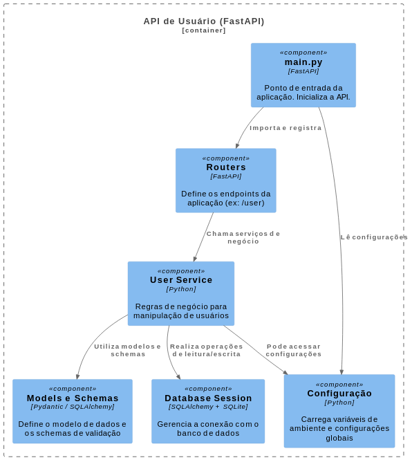

# Documentação do Projeto: Sistema de Gestão de Tarefas

---

## 1. Visão Geral

Esta aplicação é uma plataforma interna para gestão de tarefas, que permite registrar, editar, listar, filtrar, alterar status e excluir tarefas. A aplicação é composta por:

- **Backend Node:** API RESTful que gerencia as operações CRUD de tarefas.
- **Backend FastApi:** API RESTful dedicada à exposição de um do usuário.
- **Frontend:** Interface web responsiva que consome a API para interação com o usuário.

Tempo de produção 10 horas:


---

Diagrama de Contêiner – Backend Node (Model C4)


Dica:Instale a extensão PlantUML.
Acesse o arquivo doc/DiagramadeConteineresC4.puml.
Clique em “Preview” ou Alt + D para renderizar.

# ✅ Tutorial de Execução do Projeto

## 🔁 1. Clonar o repositório

```bash
git clone https://github.com/leonardorsolar/challenge-task-management.git
cd challenge-task-management
```

---

## 🐍 2. Rodar o Backend (Python - FastAPI)

```bash
cd backend/api-fastapi
python3 -m venv venv
source venv/bin/activate   # Windows: venv\Scripts\activate
pip install -r requirements.txt
uvicorn app.main:app --reload
```

---

## ⚙️ 3. Rodar o Backend (Node.js - TypeScript)

```bash
cd backend/api-node-typescript
npm install
npm run dev
```

### 👉 Dica: Instalar e usar Node.js 20 (se ainda não tiver)

---

## 💻 4. Rodar o Frontend (React.js com Vite)

```bash
cd frontend/project-management
npm install
npm run dev
```

Acesse em: [http://localhost:5173](http://localhost:5173)

### 1.1 Estrutura Geral dos Arquivos

```
project-management/
├── backend/
│   ├── api-fastapi/
│   └── api-node-typescript/
├── docs/
│   ├── image
│   ├── openapi.json
│   ├── DiagramadeComponentesC4FastApi.puml
│   ├── DiagramadeComponentesC4Node.puml
│   ├── DiagramadeComponentesC4React.puml
│   ├── DiagramadeContextoC4.puml
│   └── swagger.yaml
├── frontend/
└── README.md
```

## 2. Backend

### 2.1 Funcionalidades Implementadas

- Criar uma nova tarefa.
- Listar tarefas existentes.
- Filtrar tarefas por status: pendente, em andamento e concluída.
- Atualizar o status de uma tarefa.
- Excluir uma tarefa.
- Comunicação via JSON.

### 2.2 Tecnologias Utilizadas

- **Node.js + Express**
- **FastAPI**
- **Banco de dados: SQLite** (fácil para testes)
- Ferramenta de documentação: **Swagger / OpenAPI** para documentação da API.

### 2.3 Estrutura do Projeto:

### 2.3.1 Estrutura do Projeto Backend (Node) e Responsabilidades

```
index.ts                          # Entrada principal da aplicação

modules/
└── task/                        # Módulo de gerenciamento de tarefas
    ├── application/
    │   └── usecases/            # Casos de uso (regras de negócio)
    │       ├── CreateTaskUseCase.ts
    │       ├── DeleteTaskUseCase.ts
    │       ├── ListTasksUseCase.ts
    │       └── UpdateTaskStatusUseCase.ts
    ├── domain/                  # Entidades e interfaces de repositório
    │   ├── entities/            # Modelo de domínio (Task)
    │   └── repositories/       # Interfaces para persistência (ITaskRepository)
    ├── infrastructure/         # Implementações concretas (ex: acesso a dados)
    │   └── repositories/
    │       └── TaskRepository.ts
    ├── presentation/            # Controllers e rotas da API
    │   ├── controllers/
    │   └── routes/
    └── test/                   # Testes unitários e de integração

shared/                         # Código e recursos compartilhados
├── core/                       # Utilitários e tipos base (ex: AppError, Result, Either)
└── infrastructure/             # Configurações, conexões e APIs externas
    ├── database/               # Adapters e scripts para diferentes bancos de dados
    └── http/                   # Configuração do servidor HTTP e rotas globais
                # Ambiente virtual Python
```

Diagrama de Componentes – Backend Node (Model C4)


### 2.3.2 Estrutura do Projeto Backend (FastAPI) e Responsabilidades

```
app/
├── core/               # Configurações gerais do sistema (ex: variáveis de ambiente)
│   └── config.py
├── database/           # Configuração e gerenciamento da conexão com o banco de dados
│   └── session.py
├── models/             # Definição dos modelos e schemas (representação dos dados)
│   ├── user.py         # Modelo de dados do usuário
│   └── schemas.py      # Schemas para validação e serialização
├── routers/            # Definição das rotas/endpoints da API
│   └── user.py         # Rotas relacionadas ao usuário
├── services/           # Lógica de negócio e regras da aplicação
│   └── user_service.py # Serviços específicos para manipulação de usuários
├── main.py             # Ponto de entrada da aplicação (inicializa a API)
db.sqlite3              # Banco de dados SQLite local
doc/                    # Documentação do projeto
requirements.txt        # Dependências do projeto
venv/                   # Ambiente virtual Python
```

Diagrama de Componentes – Backend FastAPI (Model C4)


### 2.4 Documentação da API

Foi utilizado o padrão **OpenAPI (Swagger)** para documentar a API. A documentação está disponível na raiz do projeto `/doc`

Ela descreve os endpoints:

- `POST /tasks` — Criar tarefa
- `GET /tasks` — Listar tarefas (com filtro opcional por status)
- `PATCH /tasks/:id/status` — Atualizar status da tarefa
- `DELETE /tasks/:id` — Excluir tarefa


---

## 3. Frontend


### 3.1 Funcionalidades Implementadas

- Visualização da lista de tarefas.
- Filtro por status (pendente, em andamento, concluída).
- Criação de novas tarefas.
- Alteração do status da tarefa.
- Exclusão de tarefas.
- Consumo da API do backend.

### 3.2 Tecnologias Utilizadas

- **React.js** com Vite
- Biblioteca de componentes e ícones (exemplo: lucide-react).
- Axios para chamadas HTTP.
- esting-library/jest-dom

### 3.3 Estrutura do Projeto Frontend

```
frontend/
├── src/
│   ├── assets/
│   ├── components/
│   ├── pages/
│   ├── services/
│   ├── hooks/
│   ├── styles/
│   ├── util/
│   ├── test/
│   └── App.jsx
├── public/
├── package.json
└── README.md
```

Diagrama de Componentes – Frontend React (Model C4)


---

## 4. Arquitetura e Decisões Técnicas

### 4.1 Tecnologias e Justificativas

- **Backend:** Escolhi Node.js + Express pela sua simplicidade e eficiência para construir APIs RESTful, além do grande ecossistema e suporte. Adicionei ao projeto uma consulta simples na api FastApi.
- **Banco de dados:** SQLite (para protótipo rápido) : O projeto está pronto para receber também o banco de dados PostgreSQL ou Mysql(para produção).
- **Frontend:** React.js com Vite para rápido desenvolvimento e boa experiência de desenvolvimento. Procurei deixar o front livre de framework.
- **Documentação da API:** Swagger para facilitar a comunicação com outras equipes e futuros desenvolvedores. Realizei uma documentação sistema usando a OpenIa.

### 4.2 Organização do Código e Separação de Responsabilidades

- Backend FastApi separado em camadas:

  - Controllers: lidar com requisições HTTP.
  - Services: regras de negócio.
  - Models: entidades e acesso a dados.

- Backend Node separado em camadas (Arquitetura Clean Architecture):

  - **index.ts:** Ponto de entrada principal da aplicação, responsável por iniciar o servidor e injetar as dependências.
  - **modules/task/application:** Camada de aplicação que orquestra os casos de uso.
  - **modules/task/application/usecases:** Contém os casos de uso, que representam as regras específicas de negócio.
  - **modules/task/domain:** Camada de domínio que representa a lógica central da aplicação.
  - **modules/task/domain/entities:** Entidades do negócio, incluindo modelo e comportamento.
  - **modules/task/domain/repositories:** Interfaces que definem os contratos para persistência de dados.
  - **modules/task/infrastructure:** Camada de infraestrutura com implementações concretas das interfaces do domínio.
  - **modules/task/infrastructure/repositories:** Implementações dos repositórios definidos no domínio.
  - **modules/task/presentation:** Camada de apresentação, interface entre a aplicação e o mundo externo.
  - **modules/task/presentation/controllers:** Controladores que recebem requisições e invocam os casos de uso.
  - **modules/task/presentation/routes:** Arquivos que definem as rotas da API.
  - **modules/task/test:** Testes unitários e de integração para o módulo de tarefas.
  - **shared/core:** Código compartilhado que contém tipos base, utilitários e objetos para tratamento de erros e resultados (como AppError, Either, Result).
  - **shared/infrastructure:** Infraestrutura compartilhada, incluindo conexão com banco de dados e configurações.
  - **shared/infrastructure/database:** Configuração e gerenciamento da conexão com o banco de dados.
  - **shared/infrastructure/http:** Configuração do servidor HTTP, middleware e rotas globais.

- Frontend modularizado em componentes reutilizáveis, páginas e serviços para chamadas API.
- Testes organizados em pastas dedicadas, separados por tipo (unitários, integração).

### 4.3 Evolução e Escalabilidade

- **Evolução:**

  - Criar a Autenticação e autorização para acesso restrito.
  - Permissão de múltiplos usuários e atribuição de tarefas.
  - Gerenciamento por projetos.
  - Histórico de alterações em tarefas (logs).
  - Notificações e integração com outros sistemas (ex: Slack).

- **Performance:**

  - Monolito modular podendo virar um microserviço futuro.
  - Separação do backend em microserviços se necessário.

- **Manutenção:**

  - Testes automatizados ampliados.
  - Uso de CI/CD para deploy contínuo.
  - Documentação atualizada constantemente.

---

## 5. Simulação de Distribuição de Tarefas na Equipe

| Desenvolvedor | Responsabilidades                                                                                                          | Entregas Principais                                                                |
| ------------- | -------------------------------------------------------------------------------------------------------------------------- | ---------------------------------------------------------------------------------- |
| Dev Backend   | - API RESTful<br>- Modelagem de dados<br>- Serviços e lógica<br>- Documentação da API                                      | Endpoints implementados e documentados, testes backend, banco de dados configurado |
| Dev Frontend  | - Interface React<br>- Consumo da API<br>- Responsividade e usabilidade                                                    | Tela de listagem, criação, edição e exclusão de tarefas, filtros funcionais        |
| Dev QA/Docs   | - Testes automatizados (e2e, integração, unitários)<br>- Documentação do projeto<br>- Suporte a integração e versionamento | Testes completos, documentação clara, revisões de código e integração via Git      |

### Sugestões para manter qualidade e coordenação:

- Uso de **GitHub** com branches específicas para backend, frontend e testes.
- Revisão de código (pull requests) obrigatória antes de merge.
- Uso de ferramentas de CI para rodar testes automáticos.
- Comunicação diária via chat/calls para alinhamento.
- Documentação atualizada como parte do processo de entrega.

---

## 6. Testes Automatizados

- Backend: testes unitários para serviços e testes de integração dos usecases, repositórios e dos endpoints.
- Frontend: testes unitários para componentes e testes end-to-end para fluxo completo (exemplo: Playwright, Cypress).
- Cobertura mínima de 70% recomendada.

---

## 7. Versionamento

- Projeto hospedado no GitHub.
- Commits claros e objetivos.
- Uso de tags para versões.
- Branch principal protegida com revisões obrigatórias.

url: https://github.com/leonardorsolar/challenge-task-management
